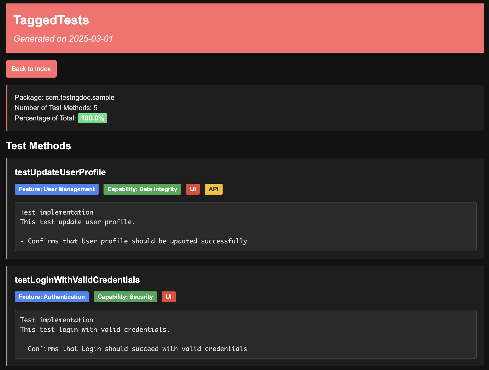
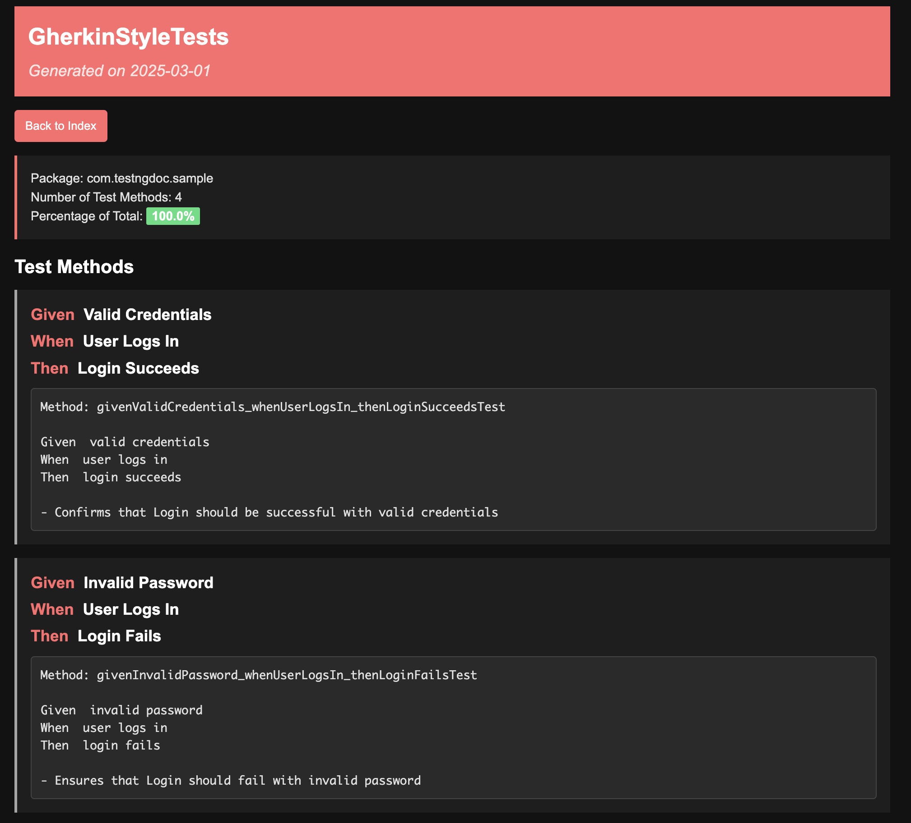

# TestNG Documentation Generator

A Java tool that generates comprehensive documentation for TestNG test classes. This tool analyzes TestNG test methods and produces HTML documentation that includes:

- Test method names and their internal logic
- Test class grouping of all underlying test methods
- Summary statistics including the total number of test methods per class and the percentage they represent among all test classes
- Gherkin-style formatting for BDD-style test method names

## Features

- Scans for TestNG test classes in a specified package
- Extracts method logic from source files
- Generates HTML documentation with a clean, modern interface
- Provides summary statistics for test coverage analysis
- Automatically formats Gherkin-style test methods (given/when/then) for better readability
- Supports multiple theme options (currently Verizon-style theme)
- Responsive design for mobile and desktop viewing

## Screenshots

Here are some screenshots of the generated documentation:

### Main Index Page


*The main index page shows a summary of all test classes with statistics*

### Test Class Detail Page



*The test class detail page shows all test methods with their Gherkin-style formatting*

### Gherkin-Style Formatting Example



*Example of how test methods with Gherkin-style names are formatted*

> **Note:** To add your own screenshots:
> 1. Create a `docs/images` directory in the project root
> 2. Take screenshots of your generated documentation
> 3. Save the screenshots in the `docs/images` directory
> 4. Update the image paths in this README if necessary

## Requirements

- Java 11 or higher
- Gradle 7.0 or higher (or use the included Gradle wrapper)

## Using as a Library

This project can be used as a library dependency in your test automation framework. For detailed integration instructions, see [INTEGRATION.md](INTEGRATION.md).

### Adding the Dependency

#### Using JitPack (Recommended)

Add the JitPack repository to your build file:

##### Maven

```xml
<repositories>
    <repository>
        <id>jitpack.io</id>
        <url>https://jitpack.io</url>
    </repository>
</repositories>

<dependencies>
    <dependency>
        <groupId>com.github.vinipx</groupId>
        <artifactId>testng-doc-generator</artifactId>
        <version>v1.0.1</version>
    </dependency>
</dependencies>
```

##### Gradle

```groovy
repositories {
    maven { url 'https://jitpack.io' }
}

dependencies {
    implementation 'com.github.vinipx:testng-doc-generator:v1.0.1'
}
```

#### From Local Maven Repository

If you've built the project locally, you can use it from your local Maven repository:

##### Maven

```xml
<dependency>
    <groupId>io.vinipx</groupId>
    <artifactId>testng-doc-generator</artifactId>
    <version>1.0.1</version>
</dependency>
```

##### Gradle

```groovy
dependencies {
    implementation 'io.vinipx:testng-doc-generator:1.0.1'
}
```

### Basic Usage

```java
import io.vinipx.testngdoc.SimpleTestNGDocGenerator;

public class DocumentationGenerator {
    public static void main(String[] args) {
        // Generate documentation for a specific directory
        SimpleTestNGDocGenerator.main(new String[]{"path/to/your/test/classes"});
    }
}

## Building the Project

```bash
./gradlew build
```

This will create a JAR file with dependencies in the `build/libs` directory.

## Publishing to Local Maven Repository

To publish the library to your local Maven repository for testing:

```bash
./gradlew publishToMavenLocal
```

## Usage as a Command-Line Tool

```bash
./gradlew runGenerator --args="<source-directory>"
```

Or run the JAR directly:

```bash
java -jar build/libs/testng-doc-generator-1.0-SNAPSHOT-all.jar <source-directory>
```

Replace `<source-directory>` with the directory containing your TestNG test classes.

## Output

The tool generates HTML documentation in a `testng-docs` directory:

- `index.html`: Summary page with links to all test classes
- `<ClassName>.html`: Detailed documentation for each test class

## Example

If your TestNG tests are in the directory `src/test/java/com/example/tests`, run:

```bash
./gradlew runGenerator --args="src/test/java/com/example/tests"
```

## How It Works

1. The tool scans all Java files in the specified directory for TestNG `@Test` annotations
2. It analyzes the source code of each test method to extract its logic
3. HTML documentation is generated using Freemarker templates
4. Statistics are calculated to show the distribution of test methods across classes
5. For methods with Gherkin-style naming (given/when/then), the tool formats them into a more readable format

## Gherkin-Style Test Method Formatting

The tool automatically detects and formats test methods that follow BDD naming conventions using given/when/then prefixes. For example:

```java
@Test
public void givenValidCredentials_whenUserLogsIn_thenLoginSucceedsTest() {
    // Test implementation
}
```

Will be formatted in the documentation as:

```
Given Valid Credentials
When User Logs In
Then Login Succeeds
```

The tool handles:
- CamelCase formatting (separates words properly)
- Underscore separation
- Multiple Gherkin steps in a single method name
- Automatic removal of "Test" suffix

### Examples of Supported Method Names

| Method Name | Formatted Output |
|-------------|------------------|
| `givenWifiOn_whenDeviceIsReboot_thenAvsLogsArePresentTest()` | **Given** Wifi On<br>**When** Device Is Reboot<br>**Then** Avs Logs Are Present |
| `givenUserProfile_whenUpdatingEmail_thenProfileIsUpdatedTest()` | **Given** User Profile<br>**When** Updating Email<br>**Then** Profile Is Updated |
| `whenUserLogsOut_thenSessionIsTerminatedTest()` | **When** User Logs Out<br>**Then** Session Is Terminated |

## Customization

### Templates

The HTML templates are stored in the `templates` directory and can be customized to match your preferred styling and layout:

- `index.ftl`: Template for the main index page
- `class.ftl`: Template for individual test class pages

### Styling

The documentation uses a modern, clean design inspired by Verizon's design system with:

- Primary Color: #d52b1e (Verizon Red)
- Secondary Color: #000000 (Black)
- Clean typography with Arial/Helvetica font family
- Responsive layout for all device sizes
- Color-coded percentage indicators
- Bold formatting for Gherkin keywords

To modify the styling, edit the CSS sections in the template files.

## Future Enhancements

- Additional theme options
- Configuration file for customizing colors and styling
- Support for TestNG groups and dependencies
- Export options (PDF, Markdown)
- Integration with CI/CD pipelines
